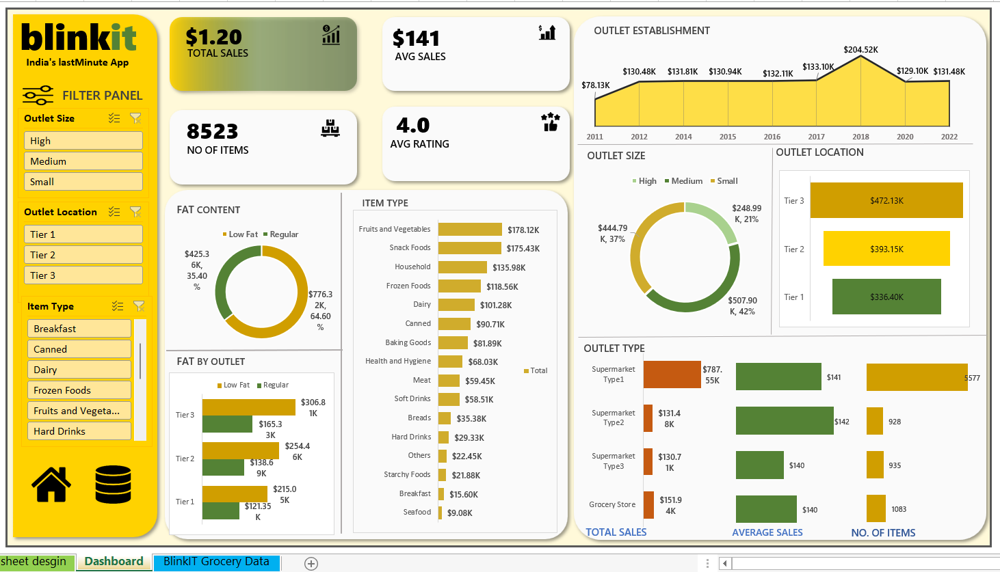

# Blinkit Grocery Sales Excel Dashboard

## Project Overview
This project is an interactive Excel dashboard created to analyze Blinkit grocery sales performance across different outlet sizes, locations, and item categories. The dashboard provides a clear business view using KPIs, charts, and slicers for quick decision-making.

## Key Metrics (KPIs)
- Total Sales
- Average Sales
- Number of Items
- Average Customer Rating

## Dashboard Features
- Interactive filter panel for:
  - Outlet Size (Small, Medium, High)
  - Outlet Location (Tier 1, Tier 2, Tier 3)
  - Item Type
- Outlet establishment trend analysis
- Sales comparison by:
  - Item Type
  - Outlet Size
  - Outlet Location
  - Fat Content
- Visual KPIs with clear layout for business insights

## Visualizations Used
- KPI Cards
- Bar Charts
- Donut Charts
- Line Chart (Outlet Establishment Trend)

## Tools & Techniques
- Microsoft Excel
- Pivot Tables
- Pivot Charts
- Slicers
- Data Cleaning & Formatting
- Dashboard Design Principles

## Dataset
The dataset represents grocery sales data including:
- Item categories
- Outlet size and location
- Sales values
- Ratings and item counts

*(Dataset is used for learning and analytical purposes.)*

## Insights Generated
- Tier 3 outlets contribute the highest total sales
- Medium-sized outlets generate strong average sales
- Fruits & Vegetables and Snack Foods are top-selling categories
- Regular fat content items have higher sales contribution

## How to Use
1. Download the Excel file from this repository
2. Open it in Microsoft Excel (Desktop version recommended)
3. Enable editing and content
4. Use slicers to interact with the dashboard

## Project Purpose
This project was created to demonstrate Excel-based data analysis and dashboarding skills for data analyst roles.

---
